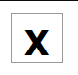
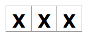
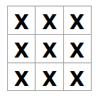
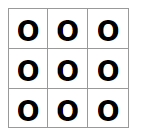

# 01 - react tic-tac-toe

Follows the [React tic-tac-toe tutorial](https://react.dev/learn/tutorial-tic-tac-toe) from their docs.


### Learning Themes:

- UI layout & interactivity
- using state to drive game logic, not just dynamic rendering


You're already familiar with React, state, and responsive UI design, but mostly focused towards web design.

This example warms us up for tackling the NYT Games by pointing what we already understand towards games, where interactivity & stateful logic become much more prominent.


---

### Installation & Usage:

If you want to run the completed version of this project, open a terminal inside `tic-tac-toe/src` and run:

```bash
npm install && npm run dev
```

>or [`pnpm`](https://pnpm.io/), which I recommend using!

---

### Tutorial

1. Scaffold a new app using Vite.

```bash
npm create vite@latest


: 'configs for new project:
    - framework: React
    - variant:   JavaScript + React Compiler    
 '
 ```

2. Clean up the starter project to start with a clean slate.

```jsx
// src/index.css -> empty
// src/App.css   -> empty

// App.jsx
function App() {

  return (
    <>
    </>
  )
}

export default App
````

---

Now let's take a quick pause and plan out our initial setup of the tic-tac-toe game - just the components we need, and some of the initial logic/state for them.

A tic tac toe game has:

- a grid,
- of 9 squares,
- which can be empty, X, or O


```jsx
[][][]
[][][]
[][][]
``` 

So we'll want:

- a unit `Square` component, which
  - has borders
  - shows X, O, or blank in the Square
- a `GameGrid` component, which
  - creates a 3x3 grid of `Square` components
  - sets the value of a square when it's clicked

That's all for now! Just like a cooking recipe, once we have those ingredients laid out, we can *then* get to work on how they all work together interactively in the overall game logic.

---

3. Make the `Square` component. 

Let's just set it up with a static value of `X` initially.

We'll use a simple button element, since playing the game means clicking the squares.

```jsx
// src/components/Square.jsx
export default function Square() {
    return (
        <button className="square">X</button>
    )
}
```

You can import this into `App.jsx` and render out just a `<Square />` for a quick test.

```jsx
// src/App.jsx
// our components
import Square from './components/Square';

function App() {

  return (
    <Square />
  )
}

export default App
```

4. We'll do a bit of basic styling for the `Square` component now.

Normally, I'd want to do this as a separate overall pass, but we don't have much to do here and the game grid won't really make sense without us having an actual grid of squares.

Since this project isn't too complicated, we'll just do all our CSS in the main `index.css`:


```css
/* src/index.css */
.square {

  background: #fff;
  border: 1px solid #999;

  float: left;
  width: 34px;

  margin-right: -1px;
  margin-top: -1px;
  padding: 0;

  font-size: 24px;
  font-weight: bold;
  text-align: center;

  line-height: 34px;
  height: 34px;
}
```

Comments explaining each property can be found in `index.css`.

Our `main.jsx` - the entrypoint of the application - is importing the `index.css`.

---

If we run the project, we can see the square styling at work:



Instead of just one `Square`, you can string a few of them together to see one row of our game board:

```jsx
// src/App.jsx
import Square from './components/Square';

function App() {

  /* The <> </> is a Fragment: 
       https://react.dev/reference/react/Fragment

     JSX should return one top-level node, so when we have multiple
     we wrap it in what's basically a placeholder node.

     This saves us from having to spam empty <div> elements / wrapper components just to satisfy that requirement.
  */

  return (
    <>
      <Square />
      <Square />
      <Square />
    </>
  )
}

export default App
```



Optionally, notice the double thickness of the border if we take out the `-1px` margins from our CSS so the squares no longer overlap by the border width: 


(We don't want this, so remember to replace those `-1px` margins before moving on!)

---

5. There's a better way of laying out our game, though: a container component that lays out unit `Squares` into a 3x3 grid.

Let's make a new component called `GameGrid` that does this, with some basic layout styling:

```jsx
// src/components/GameGrid.jsx
import Square from './Square';

export default function GameGrid() {

  // spamming 9 Squares is goofy, but we'll revisit

  return (
    <>
      <div className="grid">
        <Square />
        <Square />
        <Square />
        <Square />
        <Square />
        <Square />
        <Square />
        <Square />
        <Square />
      </div>

    </>
  )
}
```


```css
/* src/index.css */
.square { /* contents unchanged */ }


/* Uses CSS grid to cleanly lay out columns.

   Note how they're 33px wide - just like how
   .square is 34px wide *minus* the 1px border for overlap!
*/
.grid {
  display: grid;
  grid-template-columns: 33px 33px 33px;
}
```

Pop the `GameGrid` in our `App.jsx` main component, and voila:


```jsx
// our components
import GameGrid from './components/GameGrid';

function App() {

  // much cleaner!

  return (
    <GameGrid />
  )
}

export default App
```



---

OK, so that's our board layout set up!

Our next step is making our `Square` components interactive, so that clicking them changes the value.

To do this, we'll be using our old pal, [React state](https://react.dev/learn/managing-state).

Basic refresher: state stores data that persists across component re-renders, and every time we change state, the component automatically re-renders.

So what do we need?

- the value inside each `Square`:
  - should start blank
  - should have a dynamic value
- the `GameGrid` thus needs to:
  - tell each `Square` what its value is
  - initialise each `Square` with a blank value
  - track whose turn it is, to determine whether to pass `X` or `O`
  - change the value of a `Square` when it's clicked

So:
- first, we need to change `Square` so the value it displays is received as a prop
- then, we make `GameGrid` pass that value
- then, we implement logic in `GameGrid` to determine what value to pass
- finally, we fire that logic when a `Square` is clicked.

Let's get to it!

---

6. Instead of a static value, let's make `Square` receive a value via props.

I prefer to [destructure](https://developer.mozilla.org/en-US/docs/Web/JavaScript/Reference/Operators/Destructuring) the entire props object to specifically name what props get used in the function signature.

That way, you know exactly what the component takes in right away, instead of having to read the entire implementation of a component to find that out later.

```jsx
export default function Square({ value }) {
  return (
    <button className="square">{ value }</button>
  )
}
```

7. Let's clean up how our `GameGrid` manages `Square`s, since each `Square` behaves identically.

Normally we're `.map()`ping from some array of data objects, but here, that's just 9 numbers/indices.

For now, let's just pass each `Square` a static value of `"O"`.

We also pass a `key` prop, which React needs to keep track of unique elements in a series.

```jsx
// src/components/GameGrid.jsx
import Square from './Square';

export default function GameGrid() {

  /* Normally, we .map() out items from some array of data,
     but in this case we just know we need 9 squares.

     So we just need some way of generating an array of numbers
     to map Squares from:

     - Array(n)          -> gives us an array with n empty slots
     - Array(n).keys()   -> gives us an iterator of the indices, 0, ..., (n-1)
     - [...someSequence] -> uses the spread operator to generate a new array,
                            since Array().keys() is an iterator, not an array.
  */

  return (
    <div className="grid">
    {
      [...Array(9).keys()].map(
        (n) => { return <Square key={n} value="O" /> }
      )
    }
    </div>
  )
}
``` 


